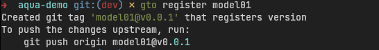
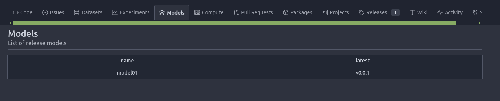
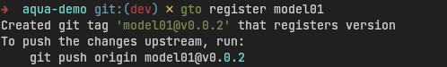
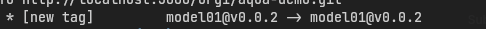
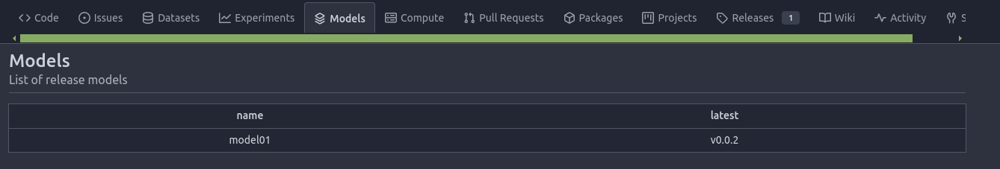
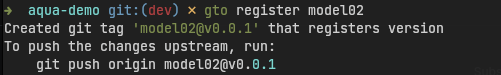
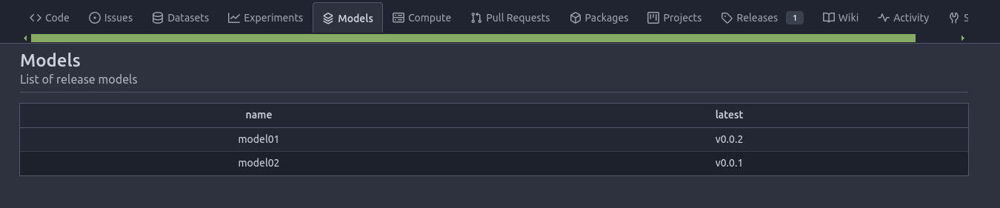
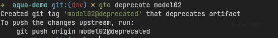

# Deploy Models
Models tab shows the list of models registered in the project.

In order to register a model in the models tab, you need to make sure to install `gto` by using this command.

```bash
pip install gto
```

If you have a new model inside the repository that you want to "deploy", you can use this command.

```bash
gto register model01
```


Then deploy the new model to remote repository.

```bash
git push origin model01@v0.0.1
```
After git push you can see that new tag has been created. It means your model already deployed.


Then you can check the new deployed model inside models tab.



If you want to update the same model with the same name, you can do it after you commit the branch.

Then you can register with the same name like so.

```bash
gto register model01
git push origin model01@v0.0.2
```





And after model01 will automatically updated to v0.0.2, the latest column will be updated accordingly.



Or you can also register to different name like so.

```bash
gto register model02
git push origin model02@v0.0.1
```




And the new model will be showed up.



## Delete Models

To delete model that already been registered you can use this command.

```bash
gto deprecate model02
git push origin model02@deprecated
```




Then if you check the model tab again. The model is gone.


