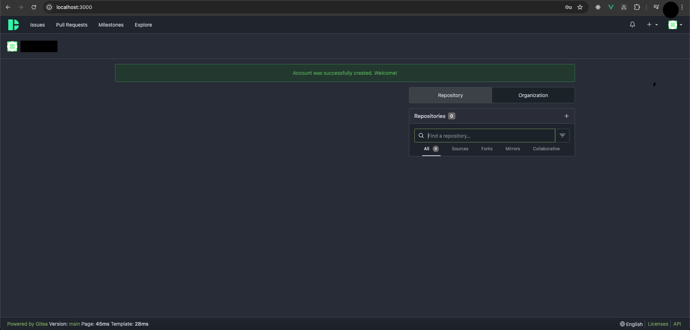
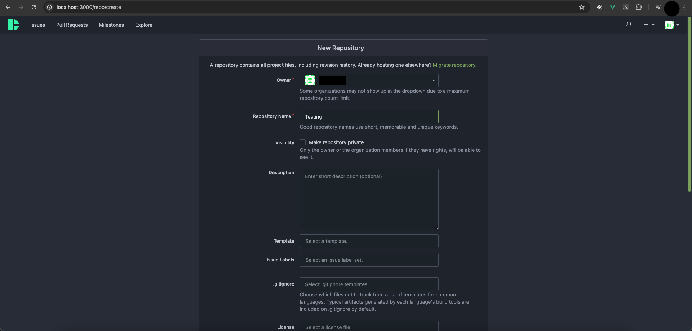
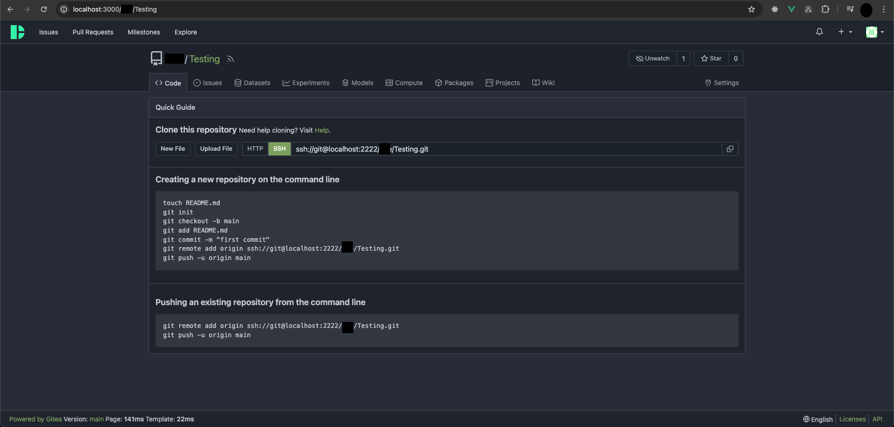

## How to DHS Gitea inside Kubernetes
Kubernetes is a orchestration server to make easy to ship the code into a server, and also a robust system. It is fairly easy to apply horizontal scaling with Kubernetes.

## Pre-Requisite
- [Minikube](https://minikube.sigs.k8s.io/docs/start/)
- [Docker](https://www.docker.com/)
- [Kubernetes](https://kubernetes.io/docs/setup/#what-s-next)

## Table of contents
- [Installation](#installation)
- [Environment](#environment)
- [Accessing App](#accessing-app)
- [Enabling Custom Domain](#enabling-custom-domain)
- [Enabling Sub Domain](#enabling-sub-domain)


## Installation
Install the DHS-Gitea inside Kubernetes, you need a several things

1. Ensure docker is running

```
docker ps

CONTAINER ID   IMAGE                    COMMAND                  CREATED       STATUS       PORTS 
```

2. Start the minikube

```
minikube start
```

3. Testing the minikube if it's running
```
kubectl get po -A
```

You should see some pods is running with `kube-system` namespace

4. After minikube been setting up, now it's time to deploy our app on the minikube cluster
```
cd kubernetes/deploy
kubectl apply -k .
```

`-k, --kustomize=''` meaning that it will combine every file specified inside `kustomization.yaml` in sequential order and apply it to the cluster.

5. Now you will see a lot of deployed manifest inside the minikube cluster
```
kubectl get all -n gitea

NAME                                      READY   STATUS    RESTARTS   AGE
pod/dhs-gitea-deployment-586746fd-l7pq5   1/1     Running   0          113m
pod/dhs-gitea-mysql-666f6dc797-h7mh4      1/1     Running   0          113m

NAME                          TYPE        CLUSTER-IP      EXTERNAL-IP   PORT(S)             AGE
service/dhs-gitea-mysql-svc   ClusterIP   10.111.110.71   <none>        3306/TCP            113m
service/dhs-gitea-svc         ClusterIP   10.110.89.85    <none>        3000/TCP,2222/TCP   113m
...
```

6. Now in-order to visit our app, we need to enable minikube `LoadBalancer` tunneling
Open your new terminal and run
```
minikube tunnel
```

Now when you run `kubectl get svc -n gitea` you will get this value
```
kubectl get svc -n gitea

NAME                  TYPE           CLUSTER-IP      EXTERNAL-IP   PORT(S)                         AGE
dhs-gitea-mysql-svc   ClusterIP      10.110.50.49    <none>        3306/TCP                        52s
dhs-gitea-svc         LoadBalancer   10.109.147.97   127.0.0.1     3000:30449/TCP,2222:31463/TCP   52s
```

The external IP now been mapped to `localhost`.

7. Now you can try to visit the `localhost:3000` on the web browser


## Environment
In order to use kubernetes environment variable, we need to setup a manifest call `ConfigMap` and consume it from `Deployment`.
You can see inside the `deploy/config.yaml` it contains the environment variable that needed on this gitea application.

```
## file: deploy/config.yaml

apiVersion: v1
kind: ConfigMap
metadata:
  name: dhs-gitea-cm
  namespace: gitea
data:
  GITEA__database__DB_TYPE: "mysql"
  GITEA__database__HOST: "dhs-gitea-mysql-svc.gitea.svc.cluster.local:3306"
  GITEA__database__NAME: "dhs-gitea"
  GITEA__database__USER: "dhs-gitea"
  GITEA__database__PASSWD: "dhs-gitea-secret"
  MYSQL_ROOT_PASSWORD: "dhs-gitea-rootsecret"
  MYSQL_DATABASE: "dhs-gitea"
  MYSQL_USER: "dhs-gitea"
  MYSQL_PASSWORD: "dhs-gitea-secret"
  TENANT: "main"
  GITEA_PORT: "3000"
  GITEA_SSH_PORT: "2222"
```

There is a weird url exists on this configmap file, you can see `GITEA__database__HOST`, why does it contains `dhs-gitea-mysql-svc.gitea.svc.cluster.local:3306`?

That is how kubernetes manifest communicate to each others, how the Gitea application communicate to the MySQL.

- `dhs-gitea-mysql-svc` is the service name, can check inside `deploy/service.yaml`
```
## file: deploy/service.yaml
...
  ports:
  - port: 3306
    protocol: TCP
    targetPort: 3306
    name: sql
  selector:
    app: dhs-gitea-mysql ## this one
```

- `.gitea` is the namespace name inside the service file above.
- `.svc.cluster.local` is what kubernetes use to indicates which manifest we're pointing at, in this case it's `service`
- `:3306` need to add the port specify inside the `deploy/service.yaml`

So basically that is all the explanation on the URL that you maybe wonder what is that, because you can't access localhost:3306 inside of the kubernetes.


## Accessing App
After you are inside the initial setup gitea page, to access the app you can follow procedure


1. Change the SSH port into same as the `deploy/config.yaml` value


2. Click install gitea

3. You will see the Gitea Login Page


4. Register account & Login, now you will see Gitea Dashboard


5. Let's add our SSH key


6. Let's try create a new repo


7. Now you will bring into the Repo Page, let's try clone it


8. You can see that we can clone and push to the repo


9. Here's how it look at the gitea dashboard


## Enabling Custom Domain
To enable custom domain, you need to use Ingress.

1. Enabling Ingress Controller Nginx

The goal of this is to access the main gitea without port-forwarding and also has a custom domain.
```
minikube addons enable ingress
```

If it's done you will see

```
kubectl get all -n ingress-nginx

NAME                                            READY   STATUS      RESTARTS   AGE
pod/ingress-nginx-admission-create-7s6qk        0/1     Completed   0          3h25m
pod/ingress-nginx-admission-patch-jdvzg         0/1     Completed   0          3h25m
pod/ingress-nginx-controller-6d5f55986b-k2mgg   1/1     Running     0          3h25m
...
```

2. Now you can try to check `ingress.yaml`
You will see `host: gitea.local` inside of that file, now in order to visit that domain, you will need to alter on `/etc/hosts`

Or if you want to change the host to anything you want, such as `gitea.test`, just remember to mapped it to `/etc/hosts`

```
## file: /etc/hosts

## your other config
...
127.0.0.1       gitea.local
```

3. After ingress been setting up, now it's time to deploy our app on the minikube cluster
```
cd kubernetes/deploy
kubectl apply -f ingress.yaml
```

4. Now you can try to visit the `gitea.local` on the web browser


## Enabling Sub Domain <> Multiple gitea instance
to be discovered soon