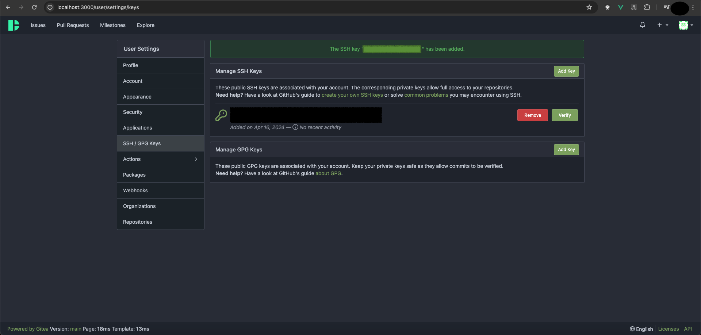
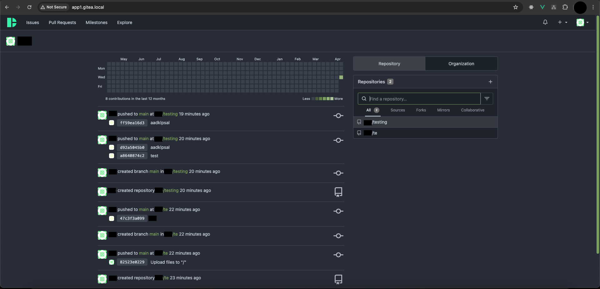

## How to DHS Gitea inside Kubernetes
Kubernetes is a orchestration server to make easy to ship the code into a server, and also a robust system. It is fairly easy to apply horizontal scaling with Kubernetes.

## Pre-Requisite
- [Minikube](https://minikube.sigs.k8s.io/docs/start/)
- [Docker](https://www.docker.com/)
- [Kubernetes](https://kubernetes.io/docs/setup/#what-s-next)

## Table of contents
- [Directory](#directory)
- [Installation](#installation)
- [Environment](#environment)
- [Accessing App](#accessing-app)
- [Enabling Custom Domain](#enabling-custom-domain)
- [Multiple instance & Sub Domain](#multiple-instance-sub-domain)


## Directory
```
├── README.md
├── app1
│   ├── config.yaml
│   ├── ingress.yaml
│   ├── kustomization.yaml
│   └── namespace.yaml
├── app2
│   ├── config.yaml
│   ├── ingress.yaml
│   ├── kustomization.yaml
│   └── namespace.yaml
├── base
│   ├── deployment.yaml
│   ├── kustomization.yaml
│   └── service.yaml
└── docs
    ├── ...
```

Explanation on the directory
1. `base` is a shared kubernetes manifests between the app that exists, our goals is to have a different app subdomain with different gitea instance.
2. `app1` it's a example of app1 that we want to deploy into `app1.gitea.local` it has it's own manifest and consuming `base1` sharing too
3. `app2` it's a example of app2 that we want to deploy into `app2.gitea.local`, pretty much same thing as `app1` 

So, if you want to add `app3`, `app4` you basically just need to update the file accordingly, but you requires to change couple of things, i'll put on "how" to do it at the end of the section, or you can jump into [Multiple instance & Sub Domain](#multiple-instance-sub-domain).

For now, let's focus on `app1` only, for a single instance gitea with single sub-domain.


## Installation
Install the DHS-Gitea inside Kubernetes, you need a several things

1. Ensure docker is running

```
docker ps

CONTAINER ID   IMAGE                    COMMAND                  CREATED       STATUS       PORTS 
```

2. Start the minikube

```
minikube start
```

3. Testing the minikube if it's running
```
kubectl get po -A
```

You should see some pods is running with `kube-system` namespace

4. After minikube been setting up, now it's time to deploy our app on the minikube cluster
```
cd kubernetes/app1
kubectl apply -k .
```

`-k, --kustomize=''` meaning that it will combine every file specified inside `kustomization.yaml` in sequential order and apply it to the cluster.

5. Now you will see a lot of deployed manifest inside the minikube cluster
```
kubectl get all -n app1

NAME                                      READY   STATUS    RESTARTS   AGE
pod/dhs-gitea-deployment-586746fd-l7pq5   1/1     Running   0          113m
pod/dhs-gitea-mysql-666f6dc797-h7mh4      1/1     Running   0          113m

NAME                          TYPE        CLUSTER-IP      EXTERNAL-IP   PORT(S)             AGE
service/dhs-gitea-mysql-svc   ClusterIP   10.111.110.71   <none>        3306/TCP            113m
service/dhs-gitea-svc         ClusterIP   10.110.89.85    <none>        3000/TCP,2222/TCP   113m
...
```

6. Now in-order to visit our app, we need to enable minikube `LoadBalancer` tunneling
Open your new terminal and run
```
minikube tunnel
```

Now when you run `kubectl get svc -n app1` you will get this value
```
kubectl get svc -n app1

NAME                  TYPE           CLUSTER-IP      EXTERNAL-IP   PORT(S)                         AGE
dhs-gitea-mysql-svc   ClusterIP      10.110.50.49    <none>        3306/TCP                        52s
dhs-gitea-svc         LoadBalancer   10.109.147.97   127.0.0.1     3000:30449/TCP,2222:31463/TCP   52s
```

The external IP now been mapped to `localhost`.

7. Now you can try to visit the `localhost:3000` on the web browser


## Environment
In order to use kubernetes environment variable, we need to setup a manifest call `ConfigMap` and consume it from `Deployment`.
You can see inside the `app1/config.yaml` it contains the environment variable that needed on this gitea application.

```
## file: app1/config.yaml

apiVersion: v1
kind: ConfigMap
metadata:
  name: dhs-gitea-cm
data:
  GITEA__database__DB_TYPE: "mysql"
  GITEA__database__HOST: "dhs-gitea-mysql-svc.gitea.svc.cluster.local:3306"
  GITEA__database__NAME: "dhs-gitea"
  GITEA__database__USER: "dhs-gitea"
  GITEA__database__PASSWD: "dhs-gitea-secret"
  MYSQL_ROOT_PASSWORD: "dhs-gitea-rootsecret"
  MYSQL_DATABASE: "dhs-gitea"
  MYSQL_USER: "dhs-gitea"
  MYSQL_PASSWORD: "dhs-gitea-secret"
  TENANT: "main"
  GITEA_PORT: "3000"
  GITEA_SSH_PORT: "2222"
```

There is a weird url exists on this configmap file, you can see `GITEA__database__HOST`, why does it contains `dhs-gitea-mysql-svc.gitea.svc.cluster.local:3306`?

That is how kubernetes manifest communicate to each others, how the Gitea application communicate to the MySQL.

- `dhs-gitea-mysql-svc` is the service name, can check inside `base/service.yaml`
```
## file: base/service.yaml
...
  ports:
  - port: 3306
    protocol: TCP
    targetPort: 3306
    name: sql
  selector:
    app: dhs-gitea-mysql ## this one
```

- `.gitea` is the namespace name inside the service file above.
- `.svc.cluster.local` is what kubernetes use to indicates which manifest we're pointing at, in this case it's `service`
- `:3306` need to add the port specify inside the `base/service.yaml`

So basically that is all the explanation on the URL that you maybe wonder what is that, because you can't access localhost:3306 inside of the kubernetes.


## Accessing App
After you are inside the initial setup gitea page, to access the app you can follow procedure


1. Change the SSH port into same as the `app1/config.yaml` value


2. Click install gitea

3. You will see the Gitea Login Page


4. Register account & Login, now you will see Gitea Dashboard


5. Let's add our SSH key


6. Let's try create a new repo


7. Now you will bring into the Repo Page, let's try clone it


8. You can see that we can clone and push to the repo


9. Here's how it look at the gitea dashboard


## Enabling Custom Domain
To enable custom domain, you need to use Ingress.

1. Enabling Ingress Controller Nginx

The goal of this is to access the main gitea without port-forwarding and also has a custom domain.
```
minikube addons enable ingress
```

If it's done you will see

```
kubectl get all -n ingress-nginx

NAME                                            READY   STATUS      RESTARTS   AGE
pod/ingress-nginx-admission-create-7s6qk        0/1     Completed   0          3h25m
pod/ingress-nginx-admission-patch-jdvzg         0/1     Completed   0          3h25m
pod/ingress-nginx-controller-6d5f55986b-k2mgg   1/1     Running     0          3h25m
...
```

2. Now you can try to check `app1/ingress.yaml`
You will see `host: app1.gitea.local` inside of that file, now in order to visit that domain, you will need to alter on `/etc/hosts`

Or if you want to change the host to anything you want, such as `app1.gitea.test`, just remember to mapped it to `/etc/hosts`

```
## file: /etc/hosts

## your other config
...
127.0.0.1       app1.gitea.local
```

3. After ingress been setting up, now it's time to deploy our app on the minikube cluster
```
cd kubernetes/app1
kubectl apply -f ingress.yaml
```

4. Now you can try to visit the `app1.gitea.local` on the web browser


## Multiple instance & Sub Domain
In order to jump into this sections, let's get back to above directory explanation again.
Do you remember that we have `app1`, `app2` directory?

That is for preparing this sections.

The goals is, each subdomain has it's own gitea instance.

On this section, we will rely heavily on the knowledge we have so far.
- [Installation](#installation)
- [Enabling Custom Domain](#enabling-custom-domain)


1. To create a new app, you just need to copy paste `app1` directory into a new one, let's say `app3`


2. Go to `app3/namespace.yaml` and update the `name` into `app3`
```
## file: app3/namespace.yaml

apiVersion: v1
kind: Namespace
metadata:
  name: app3
```

3. Go to `app3/kustomization.yaml` and update the `namespace` into `app3`
```
## file: app3/kustomization.yaml

apiVersion: kustomize.config.k8s.io/v1beta1
kind: Kustomization

namespace: app3

resources:
- namespace.yaml
- config.yaml
- ../base
- ingress.yaml
```

4. Go to `app3/ingress.yaml` and update the `host` into `app3.gitea.local`
```
## file: app3/ingress.yaml

apiVersion: networking.k8s.io/v1
kind: Ingress
metadata:
  name: dhs-gitea-ingress
  annotations:
    kubernetes.io/ingress.class: nginx
    nginx.ingress.kubernetes.io/ssl-redirect: "true"
    nginx.ingress.kubernetes.io/use-regex: "true"
spec:
  rules:
  - host: app3.gitea.local
    http:
      paths:
      - path: /
        pathType: Prefix
        backend:
          service:
            name: dhs-gitea-svc
            port:
              number: 3000
```

5. After you change all of it, remember what we did on [Enabling Custom Domain](#enabling-custom-domain)
We change the `/etc/hosts` to add the mapper to our specified ingress

```
## file: /etc/hosts

## your other config
...
127.0.0.1       app1.gitea.local
127.0.0.1       app2.gitea.local
127.0.0.1       app3.gitea.local
```

6. Open your `app3/config.yaml` update this part `GITEA__database__HOST`

```
## file: /etc/hosts
apiVersion: v1
kind: ConfigMap
metadata:
  name: dhs-gitea-cm
data:
  GITEA__database__DB_TYPE: "mysql"
  GITEA__database__HOST: "dhs-gitea-mysql-svc.app1.svc.cluster.local:3306" ## this one
  ...
```

Change the value highlighted above using `dhs-gitea-mysql-svc.[YOUR_NAMESPACE].svc.cluster.local:3306`

7. After ingress and env setup been setting up, now it's time to deploy our app on the minikube cluster
```
cd kubernetes/app3
kubectl apply -k .
```

Now we can visit `app3.gitea.local`


8. After setting up `app3.gitea.local` and you doing a bunch of registration, try to visit `app1.gitea.local` you can see both living in the different world, created account at `app3` can't be use at `app1`

9. Key Points on Multi Instance with Different Subdomain.

- Copy `app1` into `app3` or any name you prefer
- `app3/namespace.yaml` change the namespace name here
- `app3/kustomization.yaml` update the name based on #2 above
- `app3/ingress.yaml` update the host inside ingress into `appname.gitea.local` 
- `/etc/hosts` update /etc/hosts file for registering the host you created
- Apply the change by going to directory and `kubectl apply -k .`
- Try visit the `appname.gitea.local` you created.